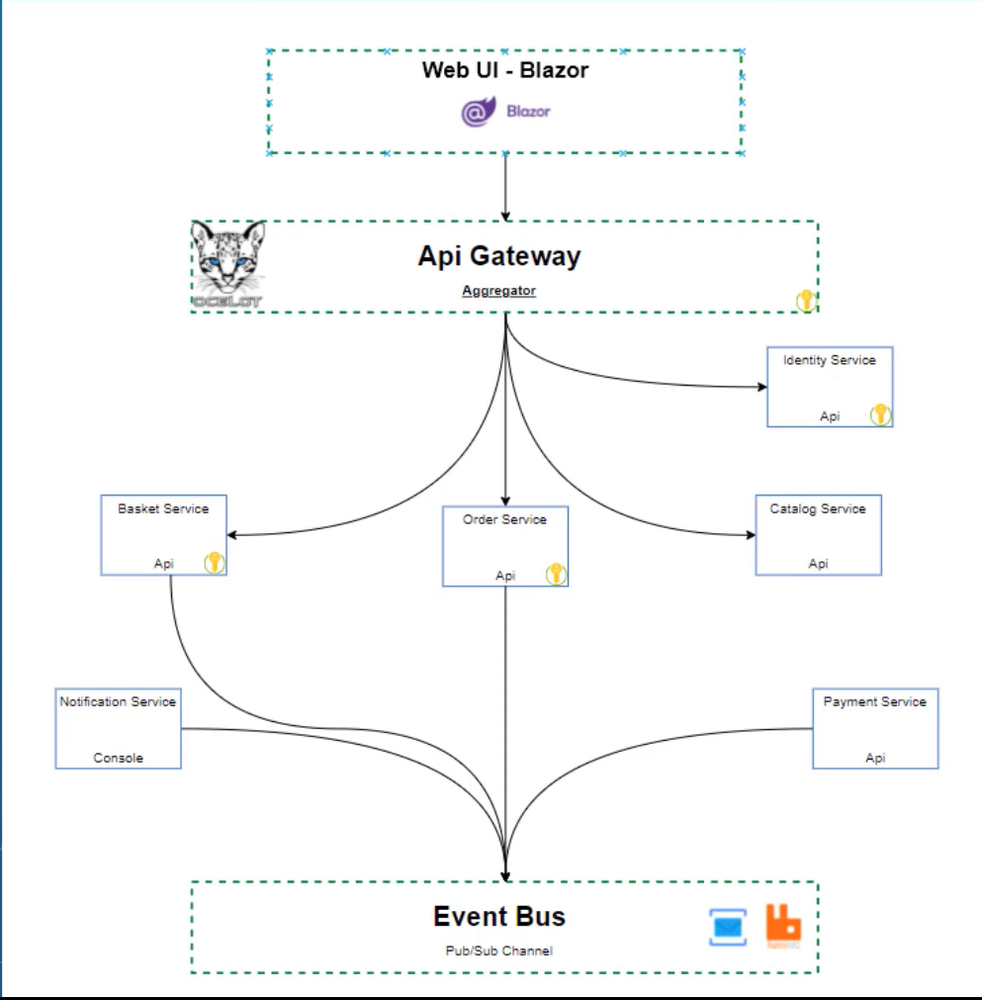

# SellingBuddy  

SellingBuddy is a microservices-based e-commerce platform designed to streamline the process of listing products, managing baskets, processing orders, and handling payments. The system is built with scalability and maintainability in mind, utilizing Blazor for the front end and RabbitMQ for inter-service communication via an event-driven architecture.

  
*(Project Architecture Diagram by @TechBuddyTR)*

## Features  
### Web UI  
The front-end application is built with **Blazor** and enables users to:  
- Browse and list products.  
- Add items to their basket.  
- Checkout their basket with shipping and payment details.  
- Register and log in to their accounts.  

The Blazor Web UI interacts with the **API Gateway** for backend requests.

### API Gateway  
The API Gateway, implemented with **Ocelot** and integrated with **Consul**, serves as a reverse proxy that routes user requests to the appropriate microservice.  

### Microservices  
#### **Identity Service**  
- Manages user registration and login processes.  
- Ensures secure authentication and authorization.  

#### **Basket Service**  
- Handles CRUD operations for the shopping basket.  
- Stores basket data in **Redis** for high performance.  

#### **Order Service**  
- Manages order creation and retrieval.  
- Publishes order events to the **EventBus** for further processing.  

#### **Catalog Service**  
- Provides functionalities to:  
  - Retrieve brands and types.  
  - Manage product operations such as create, delete, update, and fetch by filters (e.g., brand ID, type ID).  
  - Upload and retrieve product images.  
- Supports paginated item fetching for scalability.  

#### **Notification Service**  
- Sends email notifications to users regarding payment outcomes (success or failure).  

#### **Payment Service**  
- Validates payment information.  
- Publishes events for successful or failed payment transactions.  

### EventBus  
All microservices are decoupled and communicate asynchronously via the **EventBus**, which uses **RabbitMQ**.  
- The **Order Service** publishes payment-related events after order creation.  
- The **Payment Service** listens for these events, validates payment details, and publishes a follow-up event.  
- The **Notification Service** listens for the payment validation event and sends an email to the user.  

### Dockerization  
The entire system is fully containerized using **Docker**, allowing for seamless deployment and scaling.  

### Testing  
Unit tests for the EventBus have been implemented to ensure the reliability of inter-service communication.  

## Tech Stack  
- **Frontend:** Blazor  
- **Backend:** .NET (C#), Redis, RabbitMQ  
- **Containerization:** Docker  
- **Gateway:** Ocelot with Consul  
- **Messaging:** RabbitMQ  

## Getting Started  
### Prerequisites  
- Docker  
- .NET SDK  
- RabbitMQ  

### Running the Project  
1. Clone the repository:  
   ```bash
   git clone https://github.com/MrBuluc/SellingBuddy.git
   ```  
2. Navigate to the project directory and build Docker containers:  
   ```bash
   docker-compose up --build
   ```  
3. Access the application via the provided URL in your Docker logs.

## Future Enhancements  
- Add integration tests for microservices.  
- Implement advanced search and filtering options in the Catalog Service.  
- Expand notification capabilities (e.g., SMS notifications).  
- Add payment gateways for real-world use cases.  

## Contributing  
Contributions are welcome! Feel free to open issues or submit pull requests to improve the project.  

## License  
This project is licensed under the MIT License - see the LICENSE file for details.
